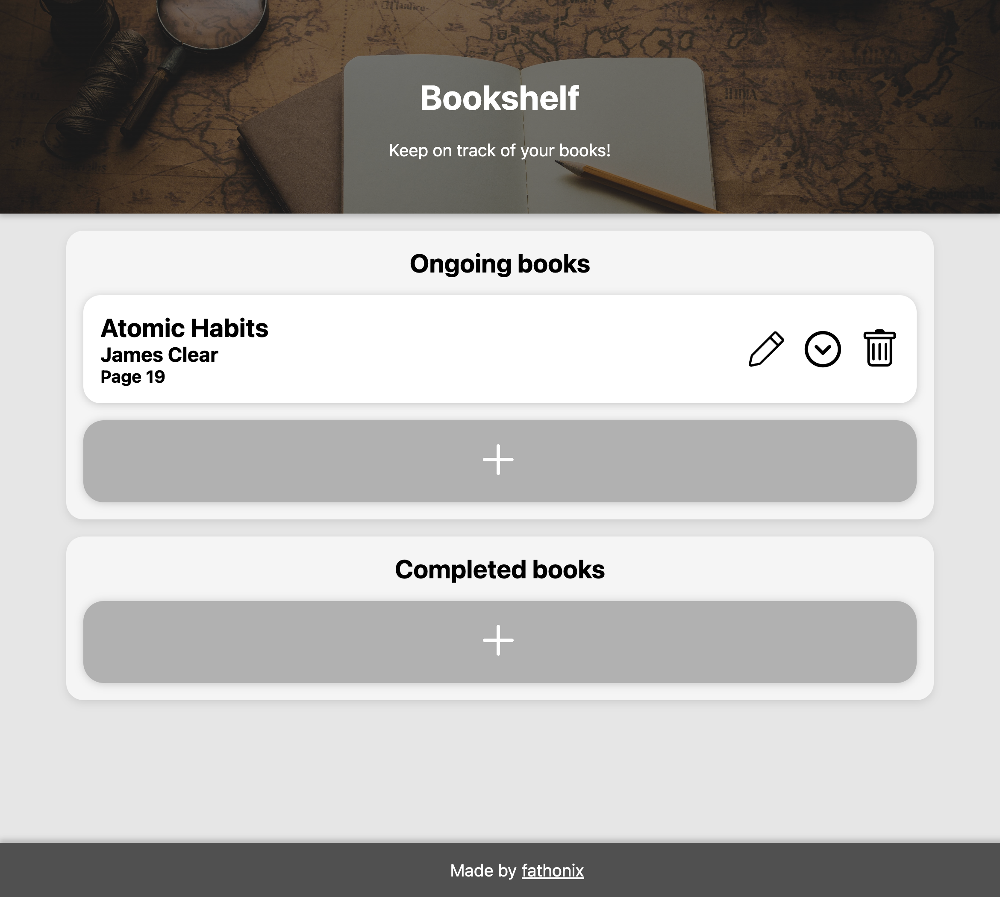

# Bookshelf

A simple website to organize books you read. Initially made for a Dicoding course submission.

  

 

## Features

- Add ongoing books
- Add completed books
- Edit existing books
- Move ongoing books to the completed section and vice versa
- Delete books
- Confirmation before discarding and deleting books
- Books are saved between sessions
- Works offline
- Responsive layout

## Tech Stack

This website uses the following technologies:

- HTML5
- CSS3
- JavaScript
- DOM and BOM
- Local Storage
